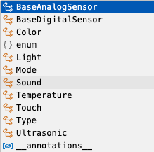

# Sensors
The sensor_test.py works with the ultrasonic sensor on port 4 

 
Digital sensors can auto detect. Analoge sensors need to be defined with the class. 
If youuse VSCode it has intelligent code completions, intellisense, to help you write the code and pick the class for the sensor. 

<TABLE>
<TR>
<TH>Digital Sensors</TH><TH>Analogue Sensors</TH>
</TR>
<TR>
<TD> 
Ultrasonic Sensor</TD>
 
<TD> Touch Sensor</TD>
<tr>
<TD></TD>
<TD> Sound Sensor</TD>
<Tr>
<TD></TD>
<TD> Light Sensor</TD>
<TR>
<TD></TD>
<TD> Compass Sensor</TD>

